# Account core

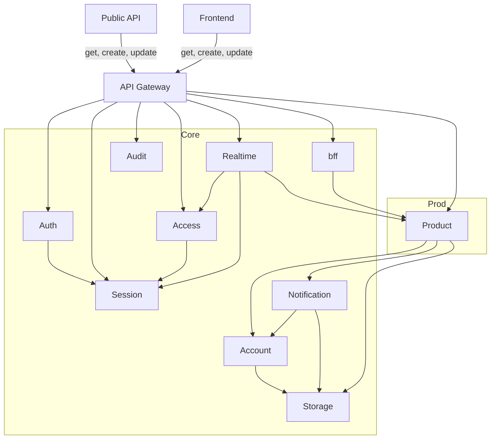

## Компоненты

[//]: # (Поля пользователя не лежат в самом юзере)

[//]: # (Юзер распределен:)

[//]: # ()
[//]: # (user &#40;identity, очень тонка модель юзера&#41;)

[//]: # (auth &#40;<- пароль тоже тут, как мы будем аутентифицироваться&#41;)

[//]: # (authz &#40;авторизация, можешь ли ты иметь доступ и админ ли ты&#41;, наш access)

[//]: # (session &#40;токены, текущая сессия&#41;)

---

## 1. Account

* **Цель:**
    * Управление жизненным циклом пользователя (регистрация, профиль, удаление)
    * Хранение и обновление персональных данных (email, телефон, имя, аватар)
    * Предоставление базовых данных о пользователе другим сервисам (по запросу)
* **НЕ Цель:**
    * Аутентификация (проверка пароля, выпуск токенов) — Auth
    * Управление сессиями — Session
    * Права и роли — Access
    * Знание, что пользователь делает в продукте
* **Что хранит:**
    * Учётные записи (ID, email, телефон, имя, статус)
    * Профиль пользователя (аватар-ссылка, настройки)
    * Историю изменений профиля
    * **НЕ хранит:** пароли, токены, сессии, роли

---

## 2. Auth

* **Цель:**
    * Проверка учётных данных (логин/пароль, OAuth)
    * Выпуск токенов (access/refresh)
    * Валидация токенов для других сервисов
* **НЕ Цель:**
    * Хранение профиля пользователя — это Account
    * Управление сессиями (TTL, отзыв, привязка к устройству) — это Session
    * Права и роли — это Access
* **Что хранит:**
    * Хэши паролей
    * Секреты (если такое будет)
    * Связь с внешними IDP (если есть OAuth)
    * **НЕ хранит:** профиль, сессии, роли

---

## 3. Session

* **Цель:**
    * Управление жизненным циклом сессии (создание, продление, отзыв)
    * Хранение контекста сессии (user_id, device, IP, TTL)
    * Предоставление быстрой валидации «сессия жива?»
    * Отзыв всех сессий пользователя (logout everywhere)
* **НЕ Цель:**
    * Проверка пароля — это Auth
    * Хранение профиля — это Account
    * Хранение ролей/прав — это Access
    * Бизнес-логика
* **Что хранит:**
    * Сессии (session_id, user_id, device_id, created_at, expires_at, status)
    * Метаданные устройства (user-agent)
    * Refresh-токены (или ссылки на них)
    * **НЕ хранит:** пароли, профиль, роли, бизнес-данные

---

## 4. Access

* **Цель:**
    * Хранение ролей и прав доступа к продукту/системе
    * Выдача решения «может ли субъект выполнить действие над ресурсом»
    * Управление ролями (создание, назначение, отзыв)
* **НЕ Цель:**
    * Аутентификация — это Auth
    * Управление сессиями — это Session
    * Знание о правах **внутри** конкретного продукта — это Product
    * Хранение бизнес-данных
* **Что хранит:**
    * Роли (role_id, name, description)
    * Права/разрешения (permission_id, resource, action)
    * Связи роль↔право
    * Назначения субъект↔роль (user_id → role_id)
    * **НЕ хранит:** профиль, сессии, пароли, бизнес-данные

---

## 5. Realtime (stateful сервис)

[//]: # (TODO статус "онлайн/не онлайн" тут же хранить или как-то вычисляется?)

* **Цель:**
    * Держать WebSocket-соединения с клиентами
    * Доставлять события от Product клиентам в реальном времени
    * Принимать события от клиентов и передавать их в Product
* **НЕ Цель:**
    * Хранить историю сообщений/событий — это Product
    * Аутентификация с нуля — валидирует токен через Session
    * Бизнес-логика продукта
    * Отправка push/email — это в Notification
* **Что хранит:**
    * Активные соединения (`user_id → socket`, только в памяти)
    * **НЕ хранит:** сообщения, историю, профиль, файлы, роли

---

## 7. BFF (Backend-for-Frontend)

* **Цель:**
    * Агрегация данных из нескольких сервисов в один ответ под клиент
    * Специфичная для клиента логика (порядок, фильтрация и т.д.)
* **НЕ Цель:**
    * Бизнес-логика продукта — это Product
    * Аутентификация — это в Auth/Session через Gateway
    * Хранение данных
    * Собственные бизнес-правила
* **Что хранит:**
    * М.б. кэш, но тут пока ХЗ
    * **НЕ хранит:** бизнес-данные, сессии, профиль, роли

---

## 8. Notification

* **Цель:**
    * Принять запрос на отправку уведомления
    * Выбрать канал доставки (email, push)
    * Отрендерить шаблон с переданными данными
    * Отправить и зафиксировать статус
* **НЕ Цель:**
    * Принимать решение, **нужно ли** отправлять (это решает инициатор)
    * Знать смысл уведомления (бизнес-контекст)
    * Хранить бизнес-данные
* **Что хранит:**
    * Шаблоны уведомлений
    * Статусы отправок (queued, sent, delivered, failed)
    * Настройки способа? отправки
    * **НЕ хранит:** бизнес-данные, профиль, решения о необходимости отправки

---

## 9. Audit

* **Цель:**
    * Принимать события аудита от всех сервисов
    * Хранить их в неизменяемом виде
    * Предоставлять доступ к логам
* **НЕ Цель:**
    * Принимать решения
    * Влиять на бизнес-логику
* **Что хранит:**
    * События аудита (who, what, when, where, result)
    * Лог
    * Индексы для поиска
    * **НЕ хранит:** бизнес-данные, сессии, профиль, роли

---

## 10. Storage

* **Цель:**
    * Хранить и отдавать файлы по запросу
* **НЕ Цель:**
    * Знать, для чего файл (аватар, вложение, документ)
    * Знать, кому принадлежит файл (это знает вызывающий)
    * Бизнес-логика
* **Что хранит:**
    * Файлы (бинарные данные)
    * Ссылки на физическое хранилище (S3-ключи)
    * **НЕ хранит:** бизнес-контекст, владельца, права

## Карта владения

| Сущность / Данные                  | Владелец                  | Кто использует (Читает / Модифицирует через API)                            |
|------------------------------------|---------------------------|-----------------------------------------------------------------------------|
| Профиль (ID, email, телефон, имя)  | **Account**               | Frontend, BFF, Product (только публичная часть); модифицирует — Account     |
| Хэш пароля, MFA-секреты            | **Auth**                  | Только Auth (внутренне)                                                     |
| Ключи подписи JWT                  | **Auth**                  | Auth (подпись), Gateway (валидация через JWKS)                              |
| Сессии (`session_id`, device, TTL) | **Session**               | Gateway, BFF, Realtime, Access — только чтение; модифицирует — Session      |
| Refresh-токены                     | **Session**               | Session, Auth (при refresh)                                                 |
| Роли                               | **Access**                | Product, BFF, Realtime — только чтение; модифицирует — Access               |
| Права/разрешения                   | **Access**                | Product, BFF, Realtime — только чтение; модифицирует — Access               |
| Назначения ролей (user ↔ role)     | **Access**                | Product, BFF, Realtime — только чтение; модифицирует — Access               |
| Доменные данные продукта           | **Product**               | Frontend (через BFF) — чтение; модифицирует — Product                       |
| Тонкие права на ресурсы            | **Product**               | Product (внутренне)                                                         |
| История сообщений / событий        | **Product**               | Frontend (через BFF), Realtime — чтение; модифицирует — Product             |
| Файлы (бинарные данные)            | **Storage**               | Product, BFF, Frontend (по ссылкам) — чтение; модифицирует — Storage        |
| Привязка «файл ↔ сущность»         | **Product** (или Account) | Product, BFF — чтение; модифицирует — владелец сущности                     |
| Шаблоны уведомлений                | **Notification**          | Только Notification (внутренне)                                             |
| Статусы уведомлений                | **Notification**          | Notification, Audit (через события) — чтение; модифицирует — Notification   |
| События аудита                     | **Audit**                 | Security, аудиторы, админы — чтение; модифицирует — **никто** (append-only) |
| WS-соединения                      | **Realtime**              | Только Realtime (внутренне)                                                 |

## Зависимости

## 1. API Gateway

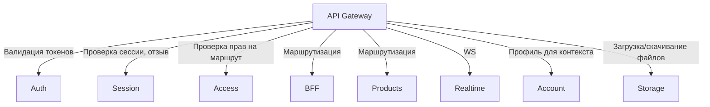
---

## 2. Products

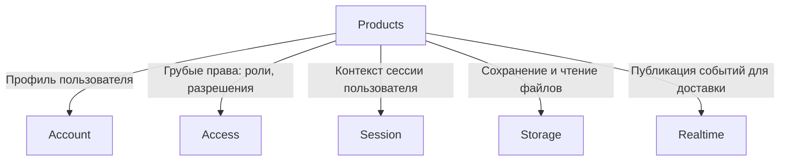

---

## 3. Account

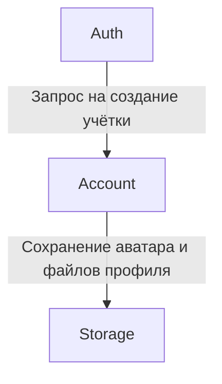

---

## 4. Auth

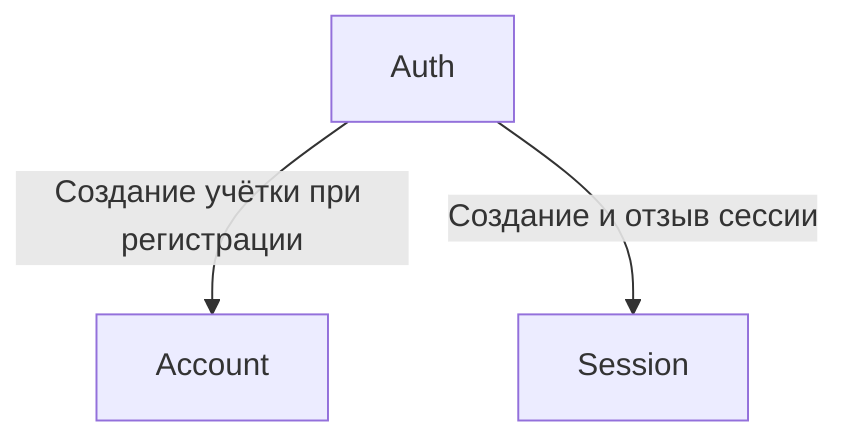
---

## 5. Access

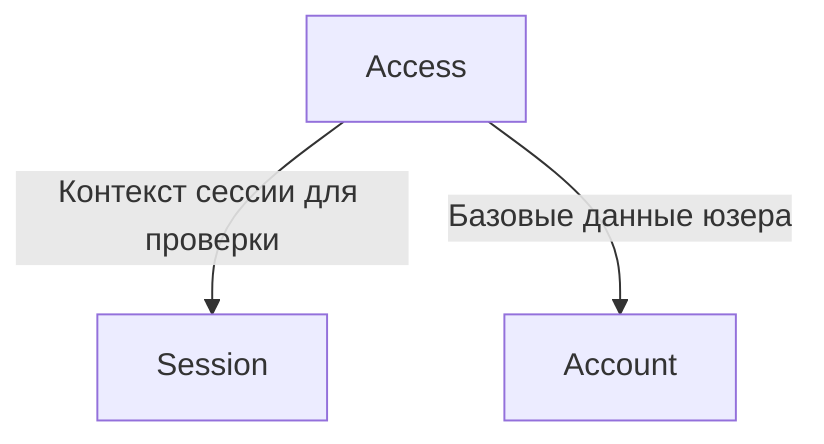

---

## 6. Realtime

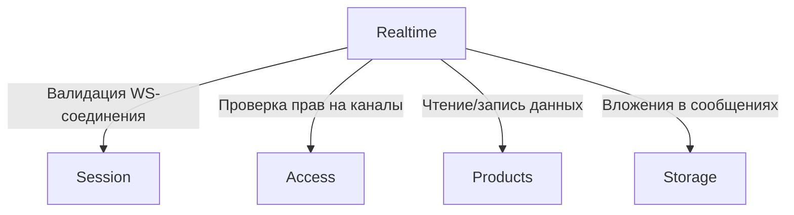
---
## 7. BFF

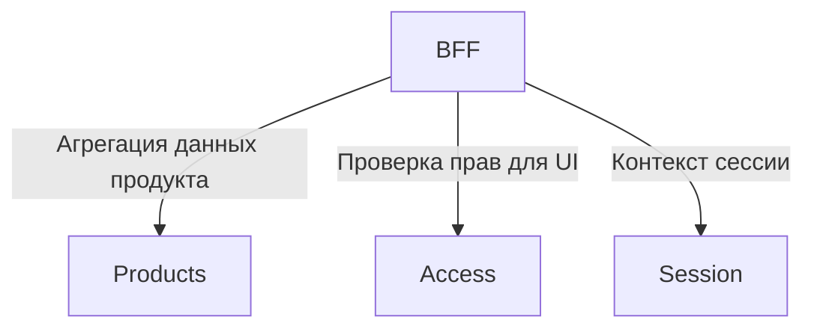
---

## Контракты

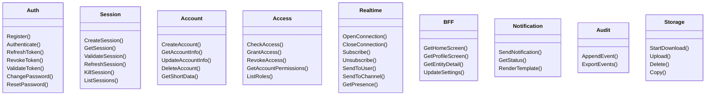

## Use cases

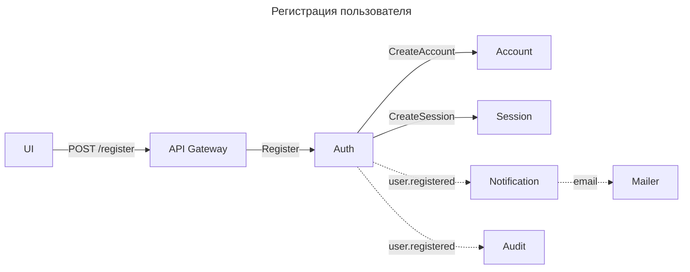

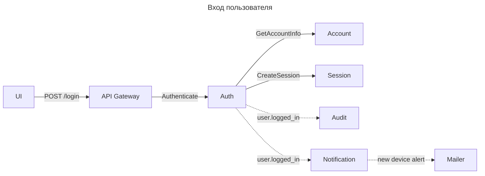

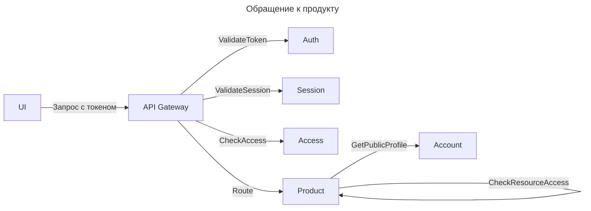

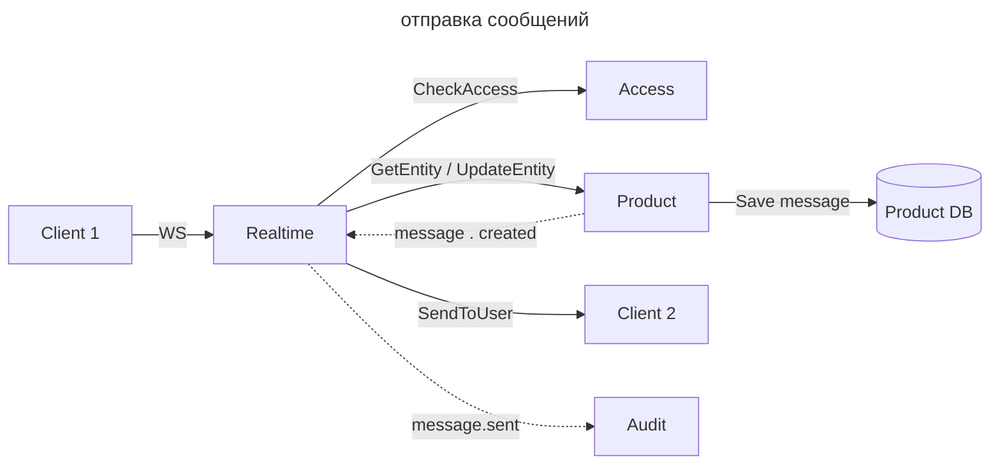

## Как добавить новый продукт

1. Пишем продукт
2. Добавить роутинг для продукта в **API Gateway**
4. Получаем деньги и идем курить бамбук
