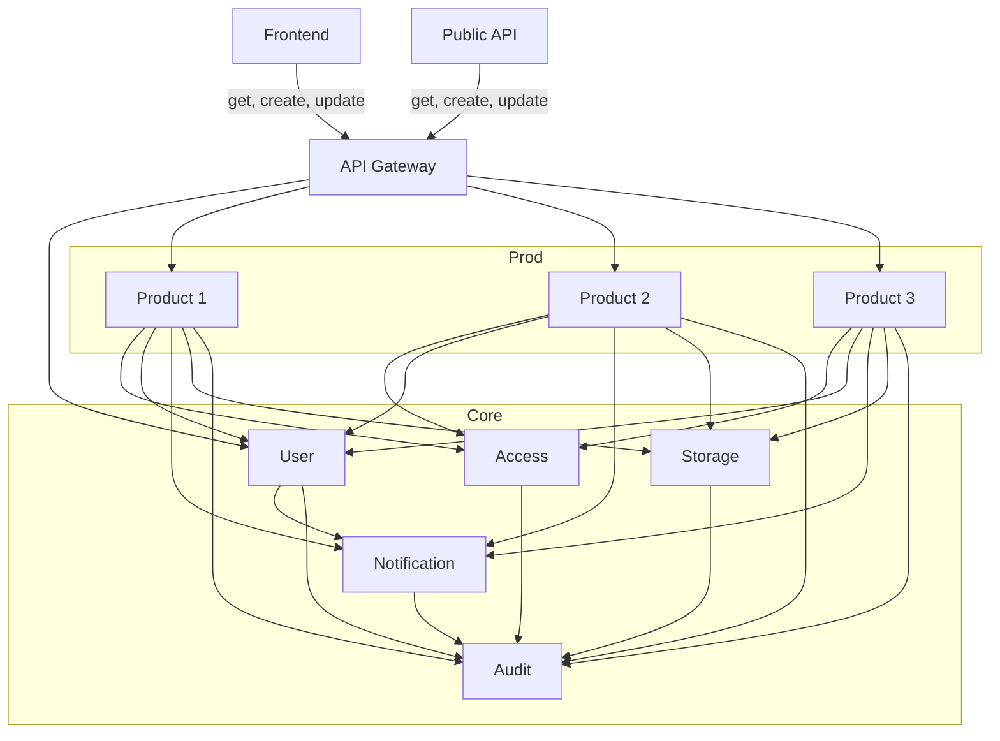
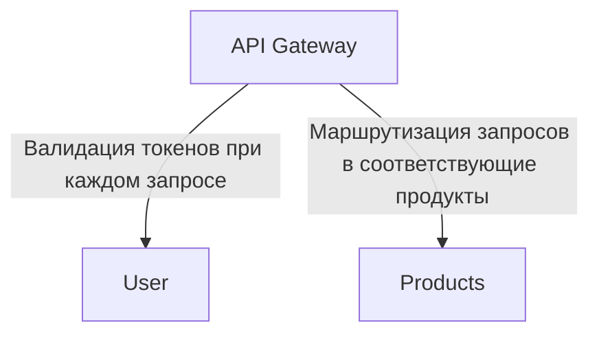
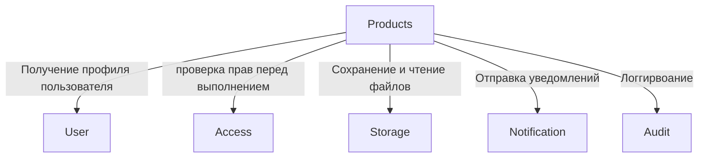
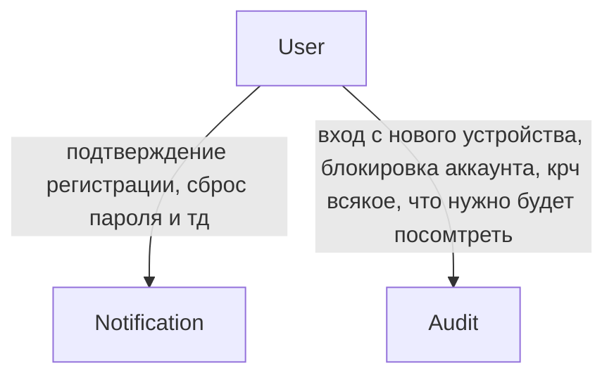
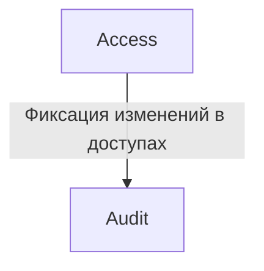
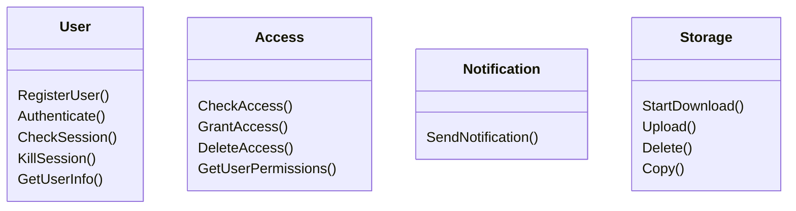
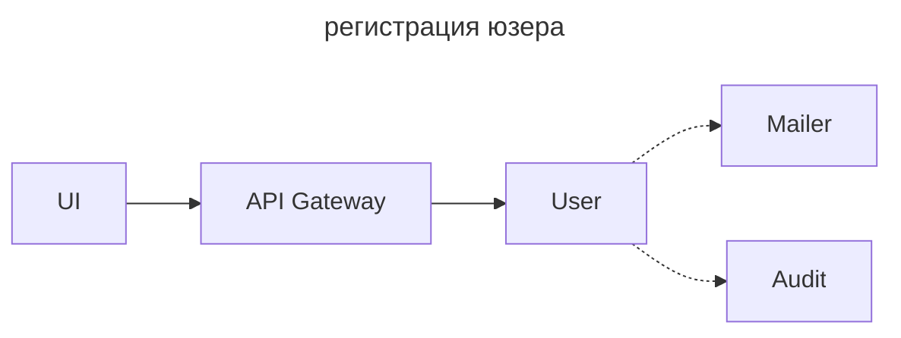
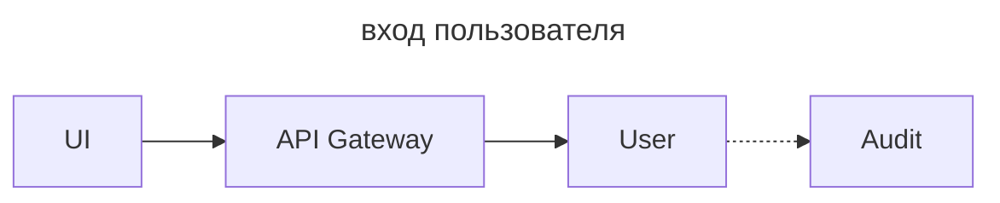
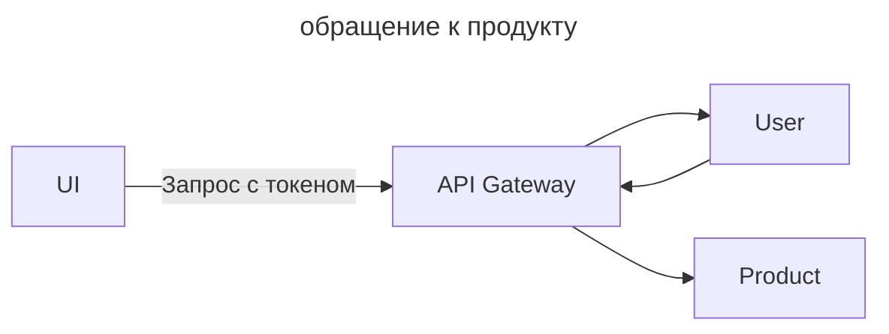
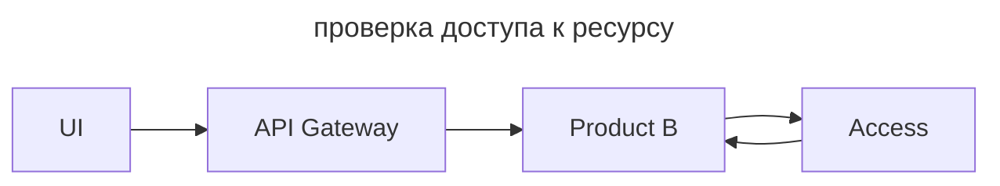

# Account core

## Компоненты

1. **User**:
    * Цель:
        * Управление жизненным циклом пользователя (регистрация, профиль)
        * Проверка учетных данных (логин/пароль)
        * Выпуск и валидация токенов сессии.
    * НЕ Цель:
        * Что юзер юзает
        * Какие у него права
    * Что хранит:
        * Учетные записи (ID, пароль, email, телефон и тд)
        * Активные сессии
2. **Access**:
    * Цель:
        * Хранение ролей и доступов на действия/ресурсы
    * НЕ Цель:
        * Не знает, на что конкрнкретно и какие это права
    * Что хранит:
        * Права доступа (Кто, На что, Роли, Доступы)
3. **Storage**:
    * Цель:
        * Хранение и отдача файлов
    * НЕ Цель:
        * Не знает, для чего эти файлы
    * Что хранит:
        * Файлы, метаданные
4. **Notification**:
    * Цель:
        * Создать сообщение
        * Отправить сообщение
    * НЕ Цель:
        * Не знает смысла уведомления (зачем оно отправляется)
        * Не принимает решения, нужно ли отправлять
    * Что хранит:
        * Шаблоны писем
        * Статусы уведомлений (доставлено, ошибка, ин прогресс)

## Карта владения

| Сущность / Данные        | Владелец | Кто использует (Читает/Модифицирует через API)       |
|--------------------------|----------|------------------------------------------------------|
| User (ID, логин, Пароль) | User     | Frontend, Продукты (только чтение)                   |
| Session (JWT Токены)     | User     | API Gateway (для пропуска запросов)                  |
| Permissions и Roles      | Access   | Продукты (для проверки допусков)                     |
| Resource permissions     | Access   | Продукты (передают в Access инфу, кто создал ресурс) |
| Product Data             | Product  | Frontend (через API конкретного продукта)            |
| Files                    | Storage  | Продукты, Frontend                                   |
| Audit Logs               | Audit    | Админы или *анал*итики (Security Team)               |

## Зависимости

## Контракты

## Use cases

## Как добавить новый продукт

1. Регистрируем политики и роли в **Access**
2. Пишем продукт
3. Добавить роутинг для продукта в **API Gateway**
4. Получаем деньги и идем купить бамбук

## Доработки (TODO)

* Core-компонент `Subscription` -- определяет, какие продукты есть (купил) у юзера

[//]: # (TODO)
* Из `User` вынести сессии, способы 