```mermaid
erDiagram
    User {
        uuid id PK
        string email
        string full_name
        string password_hash
        string status
        timestamp created_at
        timestamp updated_at
    }
    Session {
        uuid id PK
        uuid user_id FK
        string token_hash
        string device_info
        string ip_address
        timestamp expires_at
        timestamp revoked_at
    }
    UserSetting {
        uuid id PK
        uuid user_id FK
        string key
        string value
    }
    Role {
        uuid id PK
        string name
        string description
    }
    Permission {
        uuid id PK
        string name
        string description
    }
    UserRole {
        uuid user_id FK
        uuid role_id FK
    }
    RolePermission {
        uuid role_id FK
        uuid permission_id FK
    }
    File {
        uuid id PK
        uuid owner_id FK
        uuid folder_id FK
        string name
        bigint size
        string mime_type
        string hash
        string storage_path
        timestamp created_at
        timestamp updated_at
        timestamp deleted_at
    }
    Folder {
        uuid id PK
        uuid owner_id FK
        uuid parent_folder_id FK
        string name
        timestamp created_at
    }
    FileVersion {
        uuid id PK
        uuid file_id FK
        int version_number
        string storage_path
        bigint size
        timestamp created_at
        uuid created_by FK
    }
    FileShare {
        uuid id PK
        uuid file_id FK
        uuid folder_id FK
        uuid shared_with_user_id FK
        string permission_type
        timestamp expires_at
        uuid created_by FK
    }
    PublicLink {
        uuid id PK
        uuid file_id FK
        uuid folder_id FK
        string token
        string password
        timestamp expires_at
        int max_downloads
    }
    Mail {
        uuid id PK
        uuid owner_id FK
        string from
        json to
        json cc
        json bcc
        string subject
        text body
        uuid thread_id FK
        string folder
        boolean is_read
        boolean is_starred
        timestamp sent_at
        timestamp received_at
        timestamp deleted_at
    }
    Thread {
        uuid id PK
        uuid owner_id FK
        string subject
        json participants
        timestamp last_message_at
    }
    MailAttachment {
        uuid mail_id FK
        uuid file_id FK
        string file_name
        bigint size
    }
    MailLabel {
        uuid id PK
        uuid owner_id FK
        string name
        string color
    }
    MailLabelMap {
        uuid mail_id FK
        uuid label_id FK
    }
    MailFilter {
        uuid id PK
        uuid owner_id FK
        json condition
        json action
    }
    AuditLog {
        uuid id PK
        uuid user_id FK
        string action_type
        string resource_type
        string resource_id
        json details
        string ip_address
        string user_agent
        string result
        timestamp created_at
    }
    PushSubscription {
        uuid id PK
        uuid user_id FK
        string endpoint
        json keys
        string device_info
        boolean active
        timestamp created_at
        timestamp updated_at
    }
    PushPreference {
        uuid id PK
        uuid user_id FK
        string event_type
        string channel
        boolean enabled
        json quiet_hours
    }
    PushNotification {
        uuid id PK
        uuid user_id FK
        uuid subscription_id FK
        string title
        string body
        json data
        timestamp sent_at
        string delivery_status
        timestamp read_at
    }

    %% Связи
    User ||--o{ Session : "has"
    User ||--o{ UserSetting : "has"
    User ||--o{ Mail : "owns"
    User ||--o{ File : "owns"
    User ||--o{ Folder : "owns"
    User ||--o{ Thread : "owns"
    User ||--o{ MailLabel : "owns"
    User ||--o{ MailFilter : "owns"
    User ||--o{ AuditLog : "performs"
    User ||--o{ PushSubscription : "has"
    User ||--o{ PushPreference : "has"
    User ||--o{ PushNotification : "receives"
    User ||--o{ FileShare : "shared_to (shared_with_user_id)"
    User ||--o{ FileVersion : "created_by"

    User }|--o{ UserRole : "has"
    Role }|--o{ UserRole : "has"
    Role }|--o{ RolePermission : "has"
    Permission }|--o{ RolePermission : "has"

    File ||--o{ FileVersion : "has_versions"
    File ||--o{ FileShare : "has_shares"
    File ||--o{ PublicLink : "has_public_links"
    Folder ||--o{ File : "contains"
    Folder ||--o{ FileShare : "has_shares"
    Folder ||--o{ PublicLink : "has_public_links"
    File ||--o{ MailAttachment : "attached_to_mails"
    Mail ||--o{ MailAttachment : "has_attachments"
    Thread ||--o{ Mail : "has_messages"
    Mail ||--o{ MailLabelMap : "has_labels"
    MailLabel ||--o{ MailLabelMap : "assigned"
```

# Account use cases (ядро)

1. Мэйлинг
2. Пуши в браузере
3. Хитрая настройка прав
4. Мега прокси для всех подпродуктов, которая эту штуку контролирует
5. Календарь с напоминалками
6. Диск (с S3 своим, если можно физ лицу подрубить)
7. Markdown редактор
8. AI документация по всем эти штукам
9. Всякие ссылочки на контакты внешние
10. Контекстная переписка в любом сервисе (тип открыл в календаре попереписывался, перешел в диск и продолжил переписку)
11. Управление уведомлениями со всех сервисов с единой политикой.
12. Глобальная история поиска

## Ядро

1. Mailer
2. Пуши
3. Пользователи и права к ним
4. Хранилище файлов
5. Аудит действий

```
┌─────────────────────────────────────────────────────────────────────┐
│                        ПОЛЬЗОВАТЕЛЬ                                 │
│              (авторизуется, создаёт, редактирует)                   │
└─────────────────────────────┬───────────────────────────────────────┘
                              │
                              ▼
┌─────────────────────────────────────────────────────────────────────┐
│              КОМПОНЕНТ «ПОЛЬЗОВАТЕЛИ И ПРАВА»                     │
│   - Управление учётными записями (регистрация, аутентификация)    │
│   - Хранение профилей, сессий, ролей, разрешений                  │
│   - Проверка доступа к любым ресурсам (файлы, письма, уведомления)│
└────────────┬────────────────────────────┬─────────────────────────┘
             │                            │
             │ Запрос прав                │ Проверка доступа
             │                            │ при каждом действии
             ▼                            ▼
┌─────────────────────────┐   ┌─────────────────────────────────────┐
│    ХРАНИЛИЩЕ ФАЙЛОВ     │   │          МАЙЛЕР                    │
│   - Загрузка / скачивание│   │   - Отправка писем (внешним и      │
│   - Метаданные файлов    │   │     внутренним пользователям)      │
│   - Версионирование      │   │   - Получение писем (входящие)     │
│   - Привязка к владельцу │   │   - Хранение писем в ящике         │
└────────────┬─────────────┘   └──────────────┬────────────────────┘
             │                                 │
             │ Действия с файлами              │ Отправка/получение
             │ (загрузка, удаление)           │ писем
             ▼                                 ▼
┌─────────────────────────────────────────────────────────────────────┐
│                      АУДИТ ДЕЙСТВИЙ                               │
│   - Запись всех значимых событий (кто, что, когда, с каким       │
│     объектом, результат)                                          │
│   - Хранение логов для безопасности и отладки                     │
└─────────────────────────────┬─────────────────────────────────────┘
                              │
                              │ Аудиторские записи
                              │ могут инициировать уведомления
                              ▼
┌─────────────────────────────────────────────────────────────────────┐
│                          ПУШИ                                     │
│   - Отправка уведомлений на устройства пользователя               │
│     (мобильные, веб-пуши, email-пуши как дублирование)           │
│   - Получение событий от других компонентов для отправки          │
│   - Управление подписками и настройками уведомлений               │
└─────────────────────────────────────────────────────────────────────┘


--------------------------------------------------------------------------------------------------


┌─────────────────────────────────────────────────────────────────┐
│                        API Gateway / Frontend                 │
│                    (единая точка входа для клиентов)           │
└───────────────────────────────┬─────────────────────────────────┘
                                │
                                ▼
┌─────────────────────────────────────────────────────────────────┐
│                 КОМПОНЕНТ «ПОЛЬЗОВАТЕЛИ И ПРАВА»               │
│                                                                 │
│  ┌────────────┐  ┌────────────┐  ┌───────────────┐            │
│  │   User     │  │   Role     │  │  Permission   │            │
│  │   Session  │  │  UserRole  │  │RolePermission │            │
│  └────────────┘  └────────────┘  └───────────────┘            │
│                   │                                            │
│            (центральный источник прав)                         │
└───────────────────┬────────────────┬────────────────────────────┘
                    │                │
          проверка  │                │  проверка
          доступа   │                │  доступа
                    ▼                ▼
┌────────────────────────┐  ┌────────────────────────────────────┐
│  ХРАНИЛИЩЕ ФАЙЛОВ      │  │           МАЙЛЕР                  │
│                         │  │                                    │
│  ┌──────────┐          │  │  ┌──────────┐  ┌──────────────┐   │
│  │   File   │          │  │  │   Mail   │  │   Thread     │   │
│  │  Folder  │          │  │  │  Label   │  │MailAttachment│   │
│  │FileVersion│         │  │  │  Filter  │  │  (связь с    │   │
│  │ FileShare│          │  │  └──────────┘  │   File)      │   │
│  │PublicLink│          │  │                └──────────────┘   │
│  └──────────┘          │  │                                    │
└───────────┬────────────┘  └─────────────────┬──────────────────┘
            │                                   │
            │ (события: загрузка,               │ (события: отправка,
            │  удаление, шаринг)                │  получение, пометка)
            └───────────────┬───────────────────┘
                            │
                            ▼
            ┌───────────────────────────────────────────────┐
            │           АУДИТ (лог действий)               │
            │                                               │
            │  ┌──────────────────────────────────────┐     │
            │  │          AuditLog                    │     │
            │  │ (user_id, action, resource_type,     │     │
            │  │  resource_id, result, timestamp)    │     │
            │  └──────────────────────────────────────┘     │
            └───────────────────────────────┬───────────────┘
                                            │
                                            │ (события аудита могут
                                            │  триггерить уведомления)
                                            ▼
            ┌───────────────────────────────────────────────┐
            │               ПУШИ                           │
            │                                               │
            │  ┌──────────────────────────────────────────┐ │
            │  │ PushSubscription (устройства)            │ │
            │  │ PushPreference (настройки по событиям)   │ │
            │  │ PushNotification (история отправок)      │ │
            │  └──────────────────────────────────────────┘ │
            └───────────────────────────────────────────────┘
```

